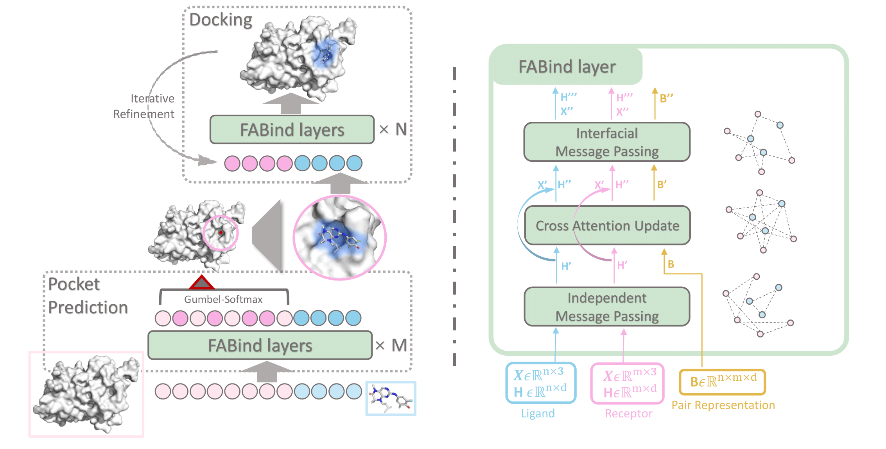

<h1 align="center">
Official Repository for the FABind Series Methods 🔥
</h1>

<div align="center">

[](https://openreview.net/forum?id=PnWakgg1RL)
[](https://arxiv.org/abs/2403.20261)

</div>

## Overview

This repository contains the source code for paper "[FABind: Fast and Accurate Protein-Ligand Binding](https://arxiv.org/abs/2310.06763)" and "[FABind+: Enhancing Molecular Docking through Improved Pocket Prediction and Pose Generation](https://arxiv.org/abs/2403.20261)". If you have questions, don't hesitate to open an issue or ask me via <qizhipei@ruc.edu.cn>, Kaiyuan Gao via <im_kai@hust.edu.cn>, or Lijun Wu via <lijun_wu@outlook.com>. We are happy to hear from you!

`Note: if you want to install or run our codes, please cd to subfolders first.`

## FABind: Fast and Accurate Protein-Ligand Binding

<div align="center">

[](https://arxiv.org/abs/2310.06763)
[](https://openreview.net/forum?id=PnWakgg1RL)
[](https://neurips.cc/virtual/2023/poster/71739)
[](https://fabind-neurips23.github.io)
[](https://huggingface.co/QizhiPei/FABind_model) 
[](https://zenodo.org/records/11352521)
[](https://github.com/KyGao/awesome-docking/tree/main)
[](https://pytorch.org/get-started/locally/)

</div>

Authors: Qizhi Pei<sup>* </sup>, Kaiyuan Gao<sup>* </sup>, Lijun Wu<sup>† </sup>, Jinhua Zhu, Yingce Xia, Shufang Xie, Tao Qin, Kun He, Tie-Yan Liu, Rui Yan<sup>† </sup>



## FABind+: Enhancing Molecular Docking through Improved Pocket Prediction and Pose Generation

<div align="center">

[](https://arxiv.org/abs/2403.20261)

[](https://huggingface.co/KyGao/FABind_plus_model) 
[](https://zenodo.org/records/11352521)
[](https://github.com/KyGao/awesome-docking/tree/main)
[](https://pytorch.org/get-started/locally/)

</div>

Authors: Kaiyuan Gao<sup>* </sup>, Qizhi Pei<sup>* </sup>, Gongbo Zhang, Jinhua Zhu, Kun He, Lijun Wu<sup>† </sup>


## News
🔥***May 27 2024***: *The training code, model checkpoint and preprocessed data for FABind+ are released!*

🔥***Apr 01 2024***: *Release our new version FABind+ with enhanced performance and sampling ability. Check the FABind+ paper on [arxiv](https://arxiv.org/abs/2403.20261). The corresponding codes will be released soon.*

🔥***Mar 02 2024***: *Fix the bug of inference from custom complex caused by an incorrect loaded parameter and rdkit version. We also normalize the order of the atom for the writed mol file in post optimization. See more details in this [commit](https://github.com/QizhiPei/FABind/commit/840631ce7957ffb9d24c71b2aa0258c93a0088e7).*

🔥***Jan 01 2024***: *Upload trained checkpoint into Google Drive.*

🔥***Nov 09 2023***: *Move trained checkpoint from Github to HuggingFace.*

🔥***Oct 10 2023***: *The trained FABind model and processed dataset are released!*

🔥***Oct 11 2023***: *Initial commits. More codes, pre-trained model, and data are coming soon.*

## About
### Citations
#### FABind
```
@inproceedings{pei2023fabind,
  title={{FAB}ind: Fast and Accurate Protein-Ligand Binding},
  author={Qizhi Pei and Kaiyuan Gao and Lijun Wu and Jinhua Zhu and Yingce Xia and Shufang Xie and Tao Qin and Kun He and Tie-Yan Liu and Rui Yan},
  booktitle={Thirty-seventh Conference on Neural Information Processing Systems},
  year={2023},
  url={https://openreview.net/forum?id=PnWakgg1RL}
}
```
#### FABind+
```
@article{gao2024fabind+,
  title={FABind+: Enhancing Molecular Docking through Improved Pocket Prediction and Pose Generation},
  author={Gao, Kaiyuan and Pei, Qizhi and Zhu, Jinhua and Qin, Tao and He, Kun and Liu, Tie-Yan and Wu, Lijun},
  journal={arXiv preprint arXiv:2403.20261},
  year={2024}
}
```

### Related
[Awesome-docking](https://github.com/KyGao/awesome-docking/tree/main)

### Acknowledegments
We appreciate [EquiBind](https://github.com/HannesStark/EquiBind), [TankBind](https://github.com/luwei0917/TankBind), [E3Bind](https://openreview.net/forum?id=sO1QiAftQFv), [DiffDock](https://github.com/gcorso/DiffDock) and other related works for their open-sourced contributions.
